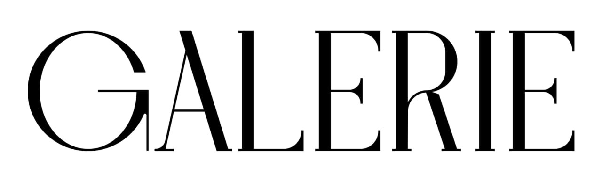
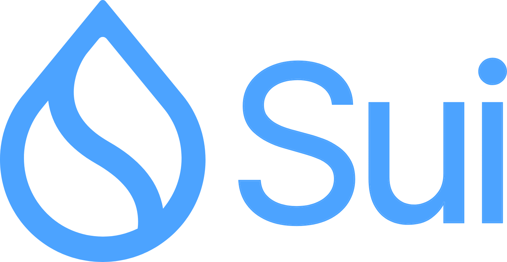
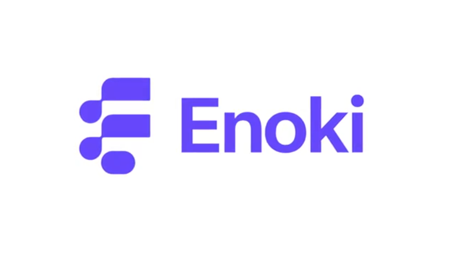

# 🖼️ Galerie — Invest in Art from $10 💸

> **Own a piece of art. Start at $10. Full Account Abstraction. No fees. Welcome to the future of art investing on [Sui](https://sui.io/).**

📄 [View the pitch deck (PDF)](https://galerie-com.github.io/pitch-deck/)

🎥 [Demo Video](https://www.youtube.com/DEMOVIDEO)

[➡️ Visit Galerie](https://galerie-com.vercel.app/)

---

## ✨ What is Galerie?

**Galerie** is a next-gen platform that lets anyone **invest in art** by buying **shares of real artworks**, starting from just **$10** — with **no gas fees**, thanks to **account abstraction**, with **every transaction sponsored through Enoki**.

---

## 🎨 Start Collecting Art

  

[➡️ Start Collecting](https://galerie-com.vercel.app/)

---

## 🚀 Why Galerie?

| 🪙 Invest from $10 | 🧑‍🎨 Own Fractional Shares | 💸 No Fees, Ever |
|-------------------|---------------------------|------------------|
| Begin your journey in art investment with as little as **$10**. | Buy and trade shares in **real-world artworks**. | Galerie **sponsors every transaction with Enoki** alongside **AA**, so there are **zero gas fees** for users. |

---

## ❓ Frequently Asked Questions

  
🖼️ What is Galerie?

  
Galerie is a decentralized platform where you can <strong>invest in artworks</strong> by purchasing fractional shares — easily and affordably.

  
💰 How does investing work?

  
Each artwork is tokenized. You can <strong>buy shares starting from $10</strong>, track performance, and eventually resell.

  
🛠️ Do I need a wallet?

  
No wallet setup needed. Just <strong>log in with your google account</strong> — it's secure, seamless, and Web2-friendly.

  
⛽ What about gas fees?

  
<strong>None.</strong> Galerie <strong>sponsors every transaction through Enoki</strong> with full <strong>Account Abstraction</strong> — you never pay transaction fees.

➡️ [See More FAQs](https://galerie-fi.vercel.app/#faq)

---

## 🧬 Built With Sui

Galerie is built on the **Sui blockchain** — a high-performance, object-centric L1 designed for parallel execution, scalability, and seamless user experiences.

[🔍 Learn more about Sui](https://sui.io/)

---

## 🏗️ Tech Stack

- 🧩 **Enoki Account Abstraction (AA)**
- 🛡️ **Google Auth (Web2-style login)**
- 🔄 **Enoki-sponsored transactions (Gasless UX)**
- 🌊 **Sui Blockchain**
- 🪙 **Asset tokenization on Sui**
- 🏦 **Vault-secured NFT custody**
- 🧮 **Fractionalization NFT Ownership via FTs**
- 💵 **Sui USDC for payments**
- 💻 **Modern Web App (Next.js + Tailwind)**

---

## 🤝 Partners & Integrations

  

  <strong>Galerie</strong> is proudly deployed on <a href="https://sui.io/"><strong>Sui</strong></a> and leverages <a href="https://enoki.mystenlabs.com/"><strong>Enoki</strong></a> for smooth onboarding.

  
  

---

> _"Galerie is democratizing art investment — **accessible**, **affordable**, and **beautifully simple**."_ 🎨

  
  
  
  

